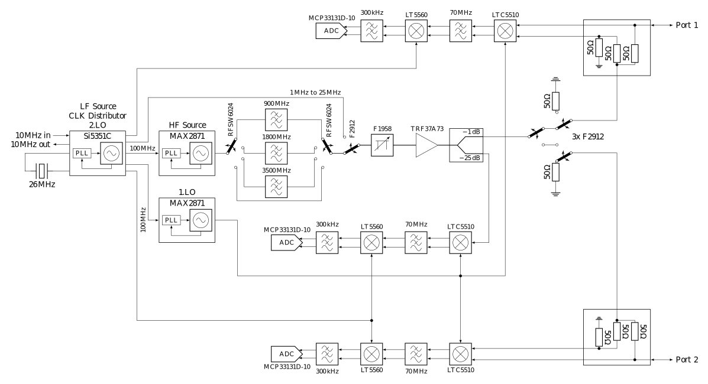
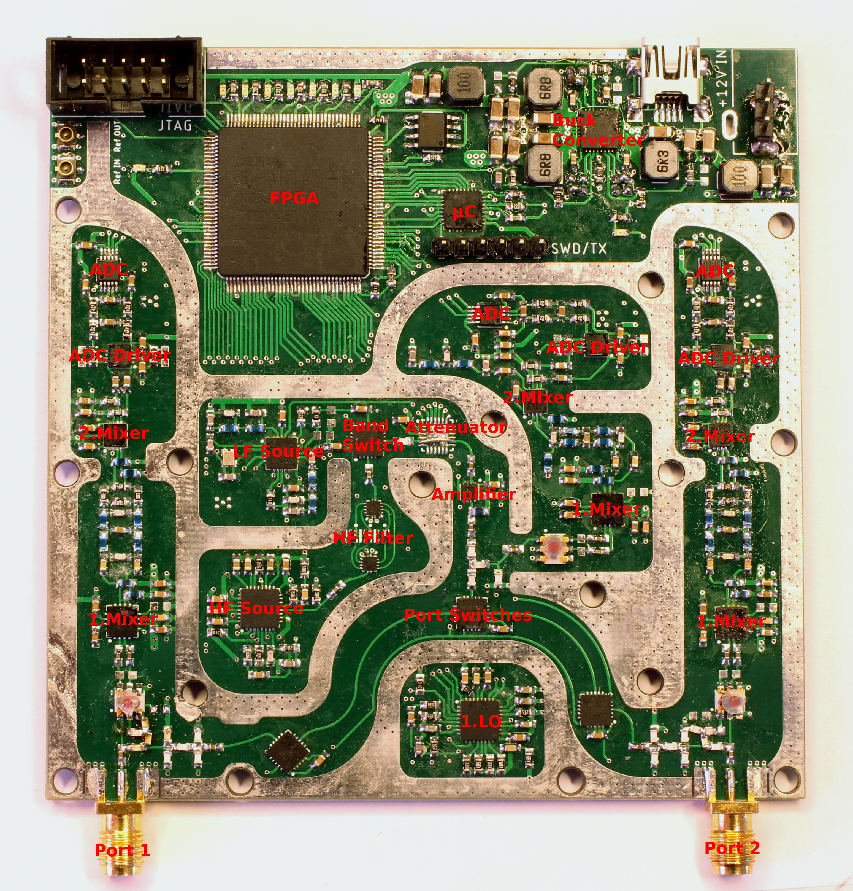
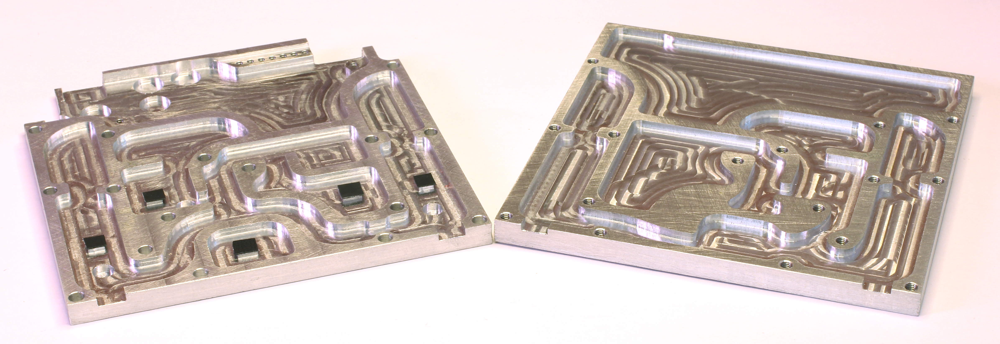
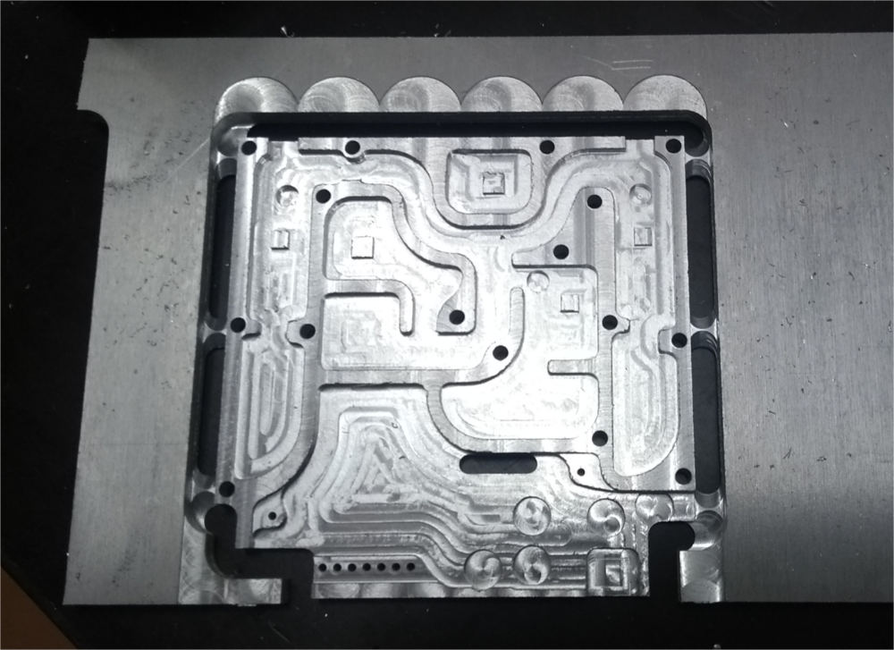
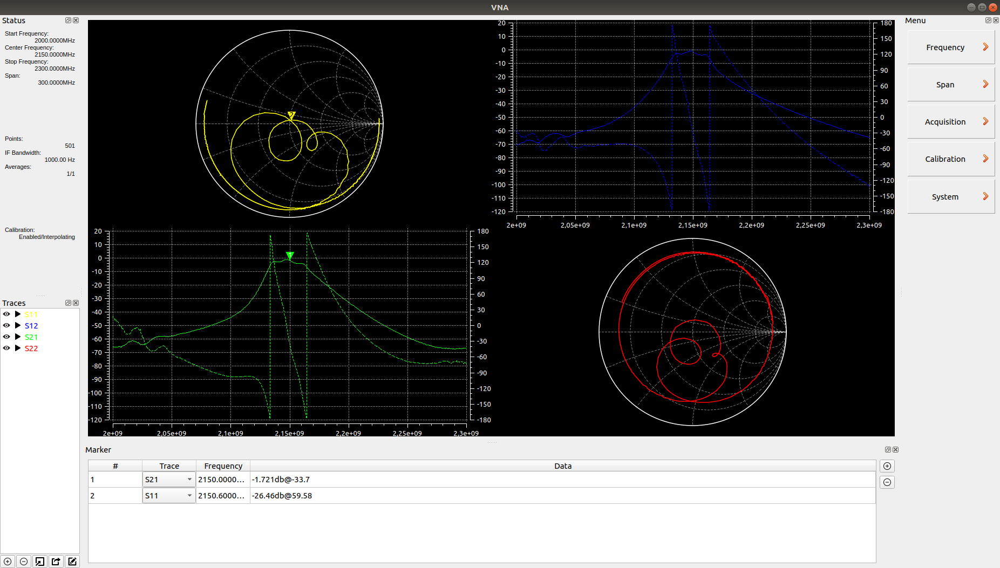
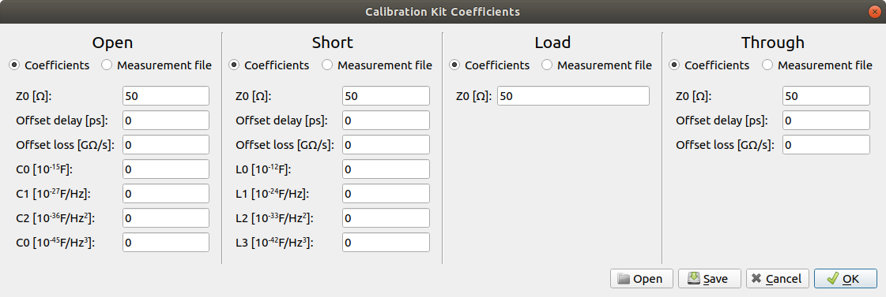
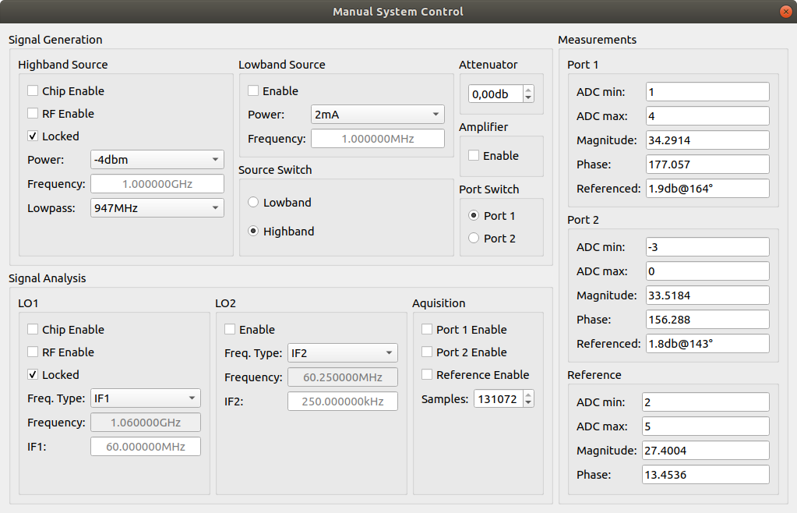
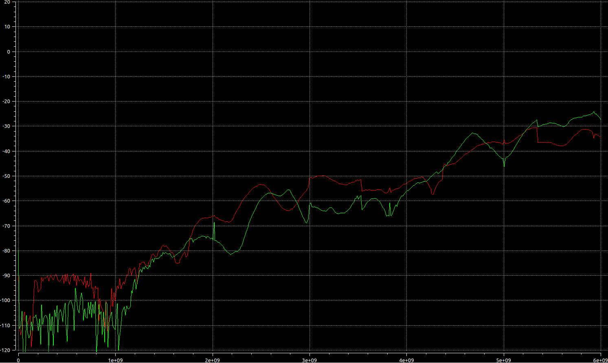
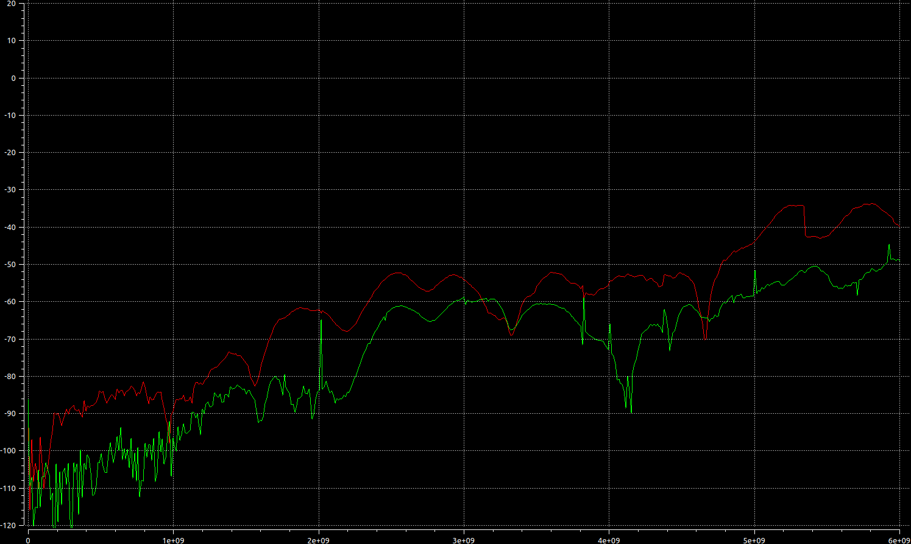
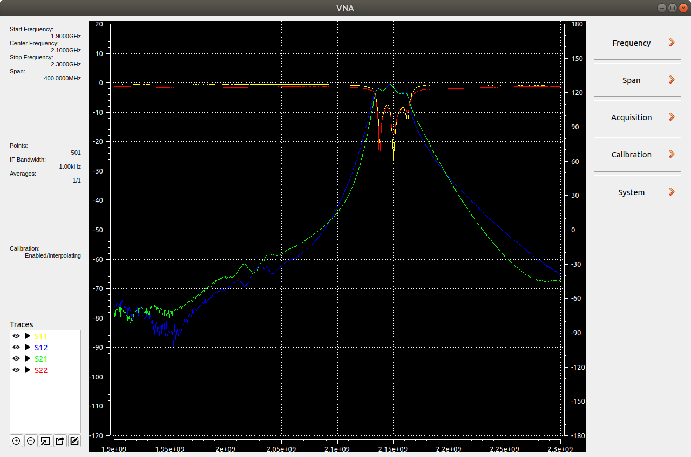

# 1MHz - 6GHz VNA

## Motivation
A VNA can be very helpful for RF experiments so I decided to build one for my next project. I already own a [pocketVNA](https://pocketvna.com/), however I found some issues with it and didn't use it very often:
* High thermal drift: you have to leave it running for 30-45 minutes before using it
* Low sweep speed: Especially with averaging enabled, a sweep can take a few minutes
* Ports are not 50 Ohm terminated, see also discussion [here](https://www.eevblog.com/forum/rf-microwave/pocketvna-any-idea-what-its-like/msg1220143/#msg1220143)

There already are some other DIY VNA projects online, especially [these](https://hforsten.com/cheap-homemade-30-mhz-6-ghz-vector-network-analyzer.html) [two](http://www.yl3akb.lv/content/vna_v2/vna_v2.php) served as inspiration.

## Design goals
* 1MHz to 6GHz usable frequency range. Both limits are essentially set by the specs of affordable RF ICs.
* Reasonable fast sweep speed
* No display, instead the data is send via USB to a PC. Generally, I prefer standalone devices but it seemed not worth the effort here. To be usable, the display would need to be reasonable large and high resolution, also GUI development is faster/easier on a PC than on a µC.
* BOM cost reduction is *not* the primary goal. A project like this takes several month and its a one-off device, slightly higher than absolutely necessary part costs are not an issue.
* Learn more about the challenges in RF designs.

## How does it work?

* The main clock source is an Si5351C, providing all the required clocks for the different blocks. It also serves as the stimulus source for frequencies below 25MHz. Its own reference clock is either a 26MHz crystal or an external 10MHz signal.
* The stimulus source for frequencies above 25MHz is a MAX2871. Its output signal is slightly filtered to reduce the amount of harmonics.
* The stimulus signal power can be adjusted between approximately -42 and -10dbm with a digital attenuator (F1958).
* After the amplifier(TRF37A73) the signal is split and the weaker part of it fed into the reference receiver.
* The stronger part of the signal can be routed to either port. In each signal path, two RF switches are used in series to achieve higher isolation between the ports.
* Instead of directional couplers, resistive return-loss-bridges are used (easier to implement for wide bandwidth).
* Both ports have completely separated receive paths. This increases BOM cost but allows measuring two parameters at once (S11 and S21 or S22 and S12). It also avoid potential isolation issues that could arise if the receive paths would merge into a single mixer/ADC.
* Each receiver consists of two down-convert mixers. The 1.IF sits at 60MHz, the 2.IF 250kHz.
* The ADCs are sampling the final IF with 16bit@1MHz.
* The acquisition and control of the PLLs, switches, attenuator etc. is handled by a Spartan 6 FPGA. This allows for nearly instant switching of the measurement frequency, only limited by the settling time of the PLLs.

## PCB Layout
The signal path can also be followed on the PCB (the attuator is replaced by a wire bridge in this picture because I damaged the IC during soldering):

* I limited myself to 10x10cm, because larger 4-Layer PCBs are getting a bit more expensive at the typical manufacturers. This was a mistake because it meant that certain sections had to move closer together. Especially the distance between the HF Source and the 1.Mixer of Port 1 is not sufficient, resulting in less than optimal isolation.
* The individual sections are divided by strips of exposed GND. The aluminium case touches all the exposed copper and further improves shielding. I expected the shielding to be better than it turned out, this is another reason why I put sections close to each other that really should be some distance apart.
* For some reason I didn't check the final design carefully enough before ordering and didn't have enough GND vias in quite a few areas. This probably degrades overall performance but I am not going to reorder (and solder!) a new PCB.

### Some hardware-related points worth noting
* There is a lot of local voltage regulation to prevent coupling of supply noise between the sections. In total there are 14 different supply rails (although most of them are at 3.3V or 5V).
* The triple Buck converter for stepping down the main 12V input rail to 6V/3V3 and 1V8 has a synchronisation feature. The synchronization pin was connected to the FPGA in order to sync the converter to the ADC sampling rate and prevent switching noise from being measured. I ended up having to cut that trace because the Spartan 6 switches its pins to pullups while being configured from the ISE IDE. This caused the buck converter to stop and the board to lose power. Note that the HSWAPEN pin only affects the pullups when configuring from the *Flash* not from the IDE. See also [this](https://forums.xilinx.com/t5/Spartan-Family-FPGAs-Archived/Spartan-6-pull-ups-during-SPI-indirect-programming-using/td-p/201743) issue. The missing synchronisation ended up not being a problem as the buck converter frequency is far enough away from the final IF.
* Due to 16bit resolution at 1MSPS, the ADCs need a fast SPI interface. Initially I used a 100MHz SPI clock and this worked well for the port 1 and the reference ADC but didn't work with the port 2 ADC (it is farther away from the FPGA thus the traces were longer). Decreasing the SPI clock to about 70MHz solved the issue while still being fast enough for the ADCs.
* The LTC5510 mixers and MAX2871 PLLs get warm (overall power consumption is about 6W, most of it dissipated in these ICs), they reached up to 70°C with an ambient temperature of 25°C. I changed the aluminium shielding design to extend down to these ICs and also serve as a heatsink. This reduced the maximum temperature by about 20°C.

## The shielding

The shielding serves multiple purposes:
* Providing RF isolation between different sections
* Improving EMI/EMC
* Serving as a case for the device, preventing shorts on the PCB when used on the bench
* Cooling (the black rectangles on the left aluminium part are adhesive cooling pads and touch the top of some ICs)
* It was CNC-machined out of 6mm aluminium. Being able to use a CNC mill, I wasn't restricted to right angles and optimised the shielding to allow for a smaller board.

## PC Software

* Written in Qt. This was my first PC software with a GUI and it took a while (and many lines of code that was rewritten a lot) to understand the concepts. While certainly not optimal, the result is absolutely usable for me.
* Flexible display of measurements in charts (Smithchart/Bodeplot). Each chart can be assigned a number of traces (e.i. plot S22 and S11 in one smithchart). The charts can be resized, moved, deleted or split into more charts.
* Import/export of touchstone files up to 4 ports. This allows saving measurements and also comparing the current measurement with others.
* Rudimentary marker system to read S-parameters at any frequency.
* Full control over start/center/stop frequencies, span, IF bandwidth, number of points, stimulus power level, ...
* SOLT calibration with fully customizable calibration kit (either from coefficients or touchstone measurements):

* Manually control the hardware components directly (helpful for hardware debugging or using the device as a simple signal source):

## How well does it work?
I am really not that sure, as I have no RF equipment to compare it to. A VNA can only be as good as the calibration kit and the only calibration kit I have is the on that came with the pocketVNA, which does not have any calibration coefficients. Why is that a problem? No calibration kit is perfect and the coefficients allow the VNA to take the imperfections into account. Without the coefficients these imperfections will be propagated to the measurements. As calibration kits with coefficients easily cost more than this whole project (at least the ones I could find) this situation will probably not change soon.

That being said, here are a few measurements:
* Isolation between ports with (green) and without (red) shielding (1MHz to 6GHz, 501 points, 100Hz IF bandwidth, both ports terminated into 50 Ohm):
  * S12:
  
  * S21:
  
  * Below about 1GHz the noise for is the actual noise floor of the ADC. Above 1GHz more and more signal leaks into the other port. This leakage is a bit worse at port 1 (S12) because the HF source is placed close to the port 1 mixers. The shielding improves the isolation somewhat but not to the extend I had hoped. Interestingly there are some peaks in the isolation sweep when the shielding is used. My best guess is that they are caused by the cavities in the shielding acting as waveguides. I am hoping to improve the shielding by adding RF absorbers to some parts of the aluminium.
* The cavity bandpass filter from [this](https://github.com/jankae/SpectrumAnalyzer) project (1.9GHz to 2.3GHz, 501 points, 1kHz IF bandwidth):
 
